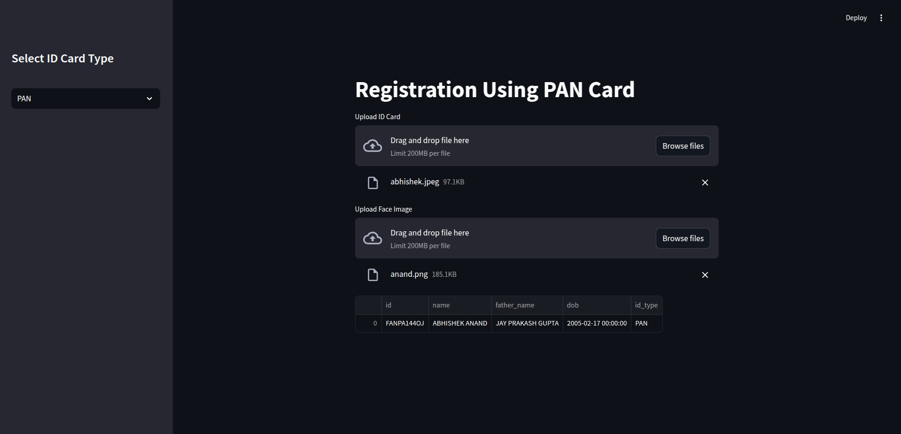

# Output


# 🛡️ eKYC System

Welcome to the eKYC (Electronic Know Your Customer) System! This project uses facial recognition, OCR, and database integration to automate identity verification. Streamlined and secure, it's built with Python and Streamlit for an interactive user experience.

---

## 🔰 Introduction

This project aims to provide a lightweight, secure, and automated way to perform KYC verification using computer vision and machine learning techniques. It integrates face verification (using DeepFace), OCR (using Tesseract), and stores results in a MySQL database. The application is built with Python and Streamlit for a responsive web-based interface.

---

## 🚀 Features

- 📸 Face verification between ID document and selfie using DeepFace
- 📄 OCR extraction from uploaded ID documents
- 🗃️ Data storage and retrieval using MySQL
- 🌐 User-friendly interface with Streamlit
- 🪄 Modular architecture for flexibility and easy debugging

---

## 🧰 Technologies Used

- **Python**: Core programming language
- **Streamlit**: Web-based front-end
- **OpenCV**: Image processing
- **DeepFace**: Face recognition and verification
- **Tesseract OCR**: Text extraction
- **MySQL**: Database for storing verified user information

---

## 📦 Libraries Required

The following libraries are required to run this project:

- `streamlit`
- `opencv-python`
- `deepface`
- `pytesseract`
- `mysql-connector-python`
- `numpy`
- `pandas`
- `Pillow`
- `pyyaml`

> 📌 Install these libraries using `requirements.txt` or manually with `pip install`.

---

## 💻 Installation

### ✅ Prerequisites

- Python 3.7 or higher
- Tesseract OCR installed and added to PATH
- MySQL Server running and configured

### 📥 Steps

1. **Clone the repository:**
   ```bash
   git clone https://github.com/Sunnykumar926/eKYC.git

2. **Navigate to the project directory:**
   ```bash
   cd eKYC

3. **Install dependencies:**
   ```bash
   pip install -r requirements.txt
   pip install -r requirements_deepface.txt

4. **Run the Streamlit app:**
   ```bash
   streamlit run app.py

---

## 📜 License

This project is licensed under the [MIT License](LICENSE). See the LICENSE file for details.

---

## 🙏 Acknowledgments

Inspired by the need for seamless, paperless KYC systems.

Thanks to the developers of [DeepFace](https://github.com/serengil/deepface), [Tesseract OCR](https://github.com/tesseract-ocr/tesseract), and [Streamlit](https://streamlit.io/).

Special appreciation to the open-source community for providing powerful tools and libraries that made this project possible.

---

## 📬 Contact

**Author:** Sunny Kumar  
📧 Email: sunnykumarbr85@gmail.com  
🌐 GitHub: [Sunnykumar926](https://github.com/Sunnykumar926)


